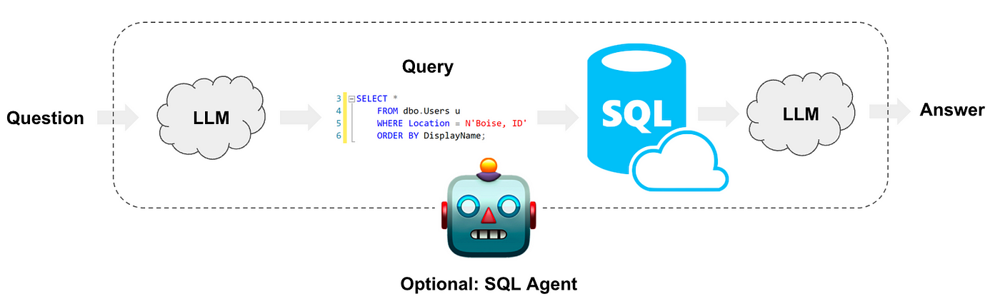

# AI SQL Querier

This project focuses on making SQL queries using natural language. We will use the MySQL database locally, although it can be easily extended to other databases, local or in cloud, such as PostgreSQL or Snowflake.

The process is as follows:

1. We make a query.
2. The LLM translates our query into SQL language.
3. The query is executed on the database.
4. The SQL response is converted into text.
5. The LLM returns a response in text.



We will use the [Sakila](https://github.com/jOOQ/sakila) public database. The Sakila database is a nicely normalised database modelling a DVD rental store (for those of you old enough to remember what that is). Its design includes a few nice features:

+ Many to many relationships.
+ Multiple paths between entities (e.g. film-inventory-rental-payment vs film-inventory-store-customer-payment) to practice joins.
+ Consistent naming of columns.
+ Primary keys are called [tablename]_[id].
+ Foreign keys are called like their referenced primary key, if possible. This allows for using JOIN .. USING syntax where supported.
+ Relationship tables do not have any surrogate keys but use composite primary keys.
+ Every table has a last_update audit column.
+ A generated data set of a reasonable size is available.


Besides, we'll use public [Query Practices](https://github.com/erzubin/MySQL/blob/master/Practice%20Queries%20on%20Sakila%20DB%20of%20MySQL.txt) on Sakila provided on [MySQL](https://www.mysql.com/) for testing our model.

### Technologies used

+ [LangChain](https://www.langchain.com/)
+ [OpenAI](https://openai.com/)
+ [SQLAlchemy](https://www.sqlalchemy.org/)
+ [MySQL](https://www.mysql.com/)


### How to use this repo

First, we need to store the OpenAI API KEY in a `.env` file to load it with the dotenv library and use it as an environment variable. In `notebooks` folder there is a jupyter notebook with a step by step explanation. In `src` folder there is the python code for querying SQL and getting a chat response, besides requirements.txt file. Use examples:


**Getting a response for a user query**
```bash
python chat.py -q "Which actors have the first name ‘Scarlett’?"
```